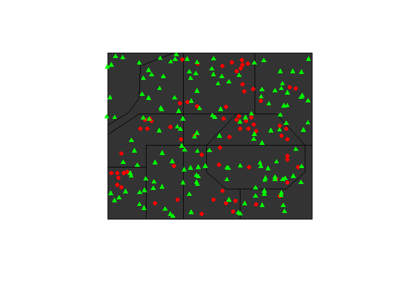

Creating Artificial GIS Data with Open Source Tools
================
Mark Simpson
July 25, 2018

Introduction
============

This is a quick and dirty rundown of how to create "fake" GIS data using open source tools (a combination of Inkscape and R). Why? Our use case was simply creating a set of example maps quickly while not having access to "real" GIS software such as ArcGIS or QGIS. In general, Inkscape is used to create vector data (points and polygons), which are then treated as GIS data in R to make a series of simple thematic maps.

Ultimately, the maps are output as images the same resolution as the original reference satellite image, and used as swappable textures within a Unity3D virtual environment.

Inkscape
========

Inkscape is a free, open source vector drawing program. Importantly, it can be used to export .dxf format lines, which can be converted to spatial objects in R and treated as GIS data for all intents and purposes.

I'm not going into major detail on how to use Inkscape, but there are some important points of this workflow:

Non-geographic Coordinates
--------------------------

We used a satellite image (literally a screen grab) as the starting point. This was imported into Inkscape, with the dimensions of the Inkscape canvas matched to the resolution of the image (Note: the canvas units were changed to pixels). These options are acccessible through *File -&gt; Document Properties... -&gt; Page*, and should look like this: 

All this meant that coordinates of all the geometry will be based on the pixel position on the image. Obviously this is arbitrary compared to a proper geographic coordinate system, but it means that the image and the geometry overlap perfectly when plotted in R.

Drawing
-------

There's not much to drawing, use the pen tool (tooltip: *"Draw Bezier curves and straight lines"*), and you may want to turn on the grid in *View -&gt; Grid* (you can also modify the grid in *File -&gt; Document Properties... -&gt; Grids*).

The correct pen tool: 

Inkscape also has a (rudimentary) layer system, if you want to keep geometry on different layers, which can make selecting them easier (for example points on one layer and borders on another). However, they need to be in separate drawings to export separately.

In the example below, I pasted in the base image, drew a triangle, and then copied it to create a set of points. One major point is that .dxf files we need to export to are lines ONLY. This is particularly important for creating points, which in Inkscape must be approximated by drawing a shape (such as a triangle) around the desired point location.


Exporting
---------

To export to the .dxf file we can feed to R once you have geometry, it's just *File -&gt; Save as... *, then changing the *Save as type:* to **Desktop Cutting Plotter (AutoCAD DXF R14)(dxf)**, with the following options:


Naturally, the first order of business in R after reading the data is converting it to the appropriate geometry type.

R Setup
=======

Since this is admittedly a weird, backwards way to create maps, we have a whole stack of packages we need to load in.

``` r
# Basic data manipulation/ plotting
library(dplyr)
library(ggplot2)

# Spatial tools
library(raster)
library(rgdal)
library(sp)
library(rgeos)
library(GISTools)

# needed to convert inkscape-created dxf lines to polygon
library(sf)

# remote sensing tools, for ggplot integration
library(RStoolbox)

# for theme_nothing
library(cowplot)

# Alternative plotting
library(png)
library(grid)
```

The Base Image
==============

First thing is to grab our image, convert it to a spatial data type (here spatialgriddataframe), and plot it, to ensure the spatial referencing is correct. Our area of interest is of Muscatatuck Training Range in Indiana, and definitely looks like a place that exists.

``` r
# Load base map
filename <- "muscatatuck.png"

# load as "RasterBrick" with multiple bands 
image <- brick(filename)

# convert to spatialgriddataframe for later processing
image.grid <- as(image, 'SpatialGridDataFrame')

# Resolution ("cells dimension")
image.grid@grid@cells.dim
```

    ## [1] 1778 1452

The resolution is 1778 by 1452, which becomes the limits of our x ("longitude") and y ("latitude") coordinate system. Plotting a true-color image is a little easier using ggRGB() function from the RStoolbox package than with vanilla ggplot(), which we'll get into later.

``` r
# plot image to test
ggRGB(image) +
    
    # Keep title from drawing
    theme(axis.title = element_blank()) +
    
    # set background fill to nothing, and draw the panels on top of the image
    theme( panel.background = element_rect(fill = NA),
        panel.ontop = TRUE )
```


To make sure everything is aligned properly, and to see where are coordinate values fall on the image, we can alter the ggplot-based grid, and draw it on top of the image.

``` r
# plot image with reference grid
ggRGB(image) +
    
    # Keep title from drawing
    theme(axis.title = element_blank()) +
    
    # set background fill to nothing, change grid colors, draw the panels on top 
    #   of the image
    theme( panel.background = element_rect(fill = NA),
           panel.grid.major = element_line( color = "white"),
           panel.grid.minor = element_line(color = "gray60"),
           panel.ontop = TRUE ) +
    
    # Override grid spacing (breaks) with pretty_breaks function 
    scale_x_continuous(breaks = scales::pretty_breaks(n = 10), 
                       expand = c(0,0)) +
    
    scale_y_continuous(breaks = scales::pretty_breaks(n = 10), 
                       expand = c(0,0))
```


The Vector Data
===============

In Inkscape I created sets of points, and polygonal boundaries. These do not reflect any real information, but are simply intended to "look" like real geographic information that one would see, such as administrative boundaries or event locations. One set of random points I created entirely within R, to show how random points can look as if they have meaningful patterns. I'll only generate the visualizations for one set of points, but the process is identical for the others (other than changing the color).

Reading in the points
---------------------

Reading the points is pretty straightforward with the readOGR() Since the raw points .dxf is really a series of small triangles, we can just get the centroids of those triangles to use as the points. Let's do that, check that they are the correct class (SpatialPoints), and then plot them.

``` r
# Read dxf created in Inkscape, will import as lines
points.dxf <- readOGR(dsn = "PointsTest.dxf")
```

    ## OGR data source with driver: DXF 
    ## Source: "PointsTest.dxf", layer: "entities"
    ## with 69 features
    ## It has 6 fields

``` r
# use rgeos to get centroid of triangles made in Inkscape
points <-  gCentroid(points.dxf, byid = TRUE)

# Check class, should be SpatialPoints
class(points)
```

    ## [1] "SpatialPoints"
    ## attr(,"package")
    ## [1] "sp"

``` r
plot(points)
```


Huzzah!

Generating Random points
------------------------

The above datasets were drawn by hand, but it's also not hard to just generate a set of points randomly. Here I set the random number generator seed for reproducability, and use runif() to sample 150 random numbers for x and y dimensions within the coordinates defined by our image resolution (0-1,778 and 0-1,458). We also need to convert the simple dataframe into a SpatialPoints class for processing later.

``` r
# Set seed for reproducability
set.seed(8675309)

# Get 150 random values in x
x <-  runif(150, 0, 1778)
y <-  runif(150, 0, 1458)

# bind into new dataframe
points.3 <- as.data.frame(cbind(x, y))

# convert to spatial points for heatmap process later
points.3.spat <- SpatialPoints(points.3)

plot(points.3.spat)
```


Reading the Polygons
--------------------

Reading in the polygon raw .dxf is just as easy, but requires a little more work to transform into polygons, which is what we really want. Namely, we have to use the sf package to convert the lines into "simple lines", then into polygons, then into *spatial* polygons. Awkward I know.

``` r
# Read dxf created in Inkscape
borders.raw <- readOGR(dsn = "BordersTest.dxf")
```

    ## OGR data source with driver: DXF 
    ## Source: "BordersTest.dxf", layer: "entities"
    ## with 12 features
    ## It has 6 fields

``` r
# Check class, loads as SpatialLinesDataFrame
class(borders.raw)
```

    ## [1] "SpatialLinesDataFrame"
    ## attr(,"package")
    ## [1] "sp"

We have spatial *lines*, but what we really need are *polygons*...

``` r
## use sf package to convert lines from dxf into polygons
# convert to 'simple feature'
borders.sf <- st_as_sf(borders.raw) 

# convert lines to polygon
borders.polygon <- st_polygonize(borders.sf)

# convert back to spatial polygon
borders <- as(borders.polygon, "Spatial")

# Should be SpatialPolygonsDataFrame
class(borders)
```

    ## [1] "SpatialPolygonsDataFrame"
    ## attr(,"package")
    ## [1] "sp"

Now we can go ahead and plot it out with "slategray" as the color:

``` r
#test Plot
plot(borders, col = "slategray")
```


Wow. Just wow. It's... definitely shapes.

We also need to do a little bit of setup for later mapping, by giving the polygons ID numbers. Note the indexing syntax of the SpatialPolygonsDataFrame object is a little weird, you have to access the data "slot" with the *@\* symbol. From there, it indexes like any other dataframe in R with the *$\* symbol.

``` r
#create id field for merging later, needs to be 0-11
borders@data$id <- 0:(nrow(borders@data) - 1)
```

Plotting Test
-------------

While we want to plot everything in ggplot and export it all pretty-like, we can do a quick and dirty check that everything is plotting in the right place with the default plot() function and using the Add = TRUE argument.

``` r
plot(borders, col = "gray20")
plot(points, pch = 16, col = "red", add = TRUE)
plot(points.3.spat, pch = 17, col = "green", add = TRUE)
```



Jeepers creepers, that's an ugly map.

Good thing we're not done.

Exporting Vector Maps
=====================

Now that we have the points and polygons we want, we can go ahead and plot them and export them at the same resolution as our base satellite image. This involves quite a bit of fiddling with the parameters of ggplot() in order to strip the various labels, axes, and background elements to get "just" the geometry. I'm also storing the plot as an object to call it later when we write it to a png image.

Plotting Points 1
-----------------

Instead of using the default plotting function, which is somewhat limited, it's better to use ggplot(). Unfortunately ggplot() is horrendously weird when it comes to syntax.

Generally, you can conceptualize a plot as a series of layers and attributes, which are created and modified using a series of stacked functions. For example, below geom\_point() draws the points on an empty ggplot(), with the given data and aesthetic (*aes()* ) mapping (like use "x" for the x dimension placement). The rest is just the various things parameters of the plot that need to be deleted or made transparent so our final image is just the image, and doesn't come with a bunch of extraneous labels. We also have to manually set the "limits" of the plot or there will be a large buffer of white space around the image.

``` r
points.map <- ggplot() +
    # call points as dataframe
    geom_point(data = as.data.frame(points), 
               aes(x = x, y = y), 
               color = "black", 
               fill = "red",
               pch = 21,
               size = 8) +

    # removes all theme stuff, theme_nothing from cowplot package
    theme_nothing() +
    
    #manually set limits of x and y with no buffer
    scale_x_continuous(limits = c(0, 1778), expand = c(0,0)) +
    scale_y_continuous(limits = c(0, 1452), expand = c(0,0)) +
    labs(x = NULL, y = NULL) +
    
    # Stuff to get actual alpha
    theme(
        panel.background = element_rect(fill = "transparent") # bg of the panel
        , plot.background = element_rect(fill = "transparent", color = NA) # bg of the plot
        , panel.grid.major = element_blank() # get rid of major grid
        , panel.grid.minor = element_blank() # get rid of minor grid
        , legend.background = element_rect(fill = "transparent") # get rid of legend bg
        , legend.box.background = element_rect(fill = "transparent") # get rid of legend panel bg
    )

# Call the plot
points.map
```


Note the points look pretty gigantic on-screen, but on the final png they appear much smaller thanks to monkeying with the export resolution.

Okay, to export the map we call png with the specified parameters (again matching the resolution of our base image). "Cairo" is used because this anti-aliases all the geometry, making everything look smooth instead of pixellated.

``` r
# designate filename, resolution
png( filename = "points_map.png", 
     type = "cairo", 
     units = "px", 
     width = 1778, 
     height = 1452,
     bg = "transparent")

# call previous plot
points.map

# write plot
dev.off()
```

Plotting Polygons (Borders)
---------------------------

This is extremely similar to the above, but with addition of needing to "fortify" the borders object, which rearranges certain spatial datatypes into a ggplot-friendly format. Since the lines are white, when plotting the example, we just need to override the transparent background.

``` r
# convert to ggplot friendly format
borders.fort <- fortify(borders)
```

    ## Regions defined for each Polygons

``` r
# Create writeable plot
# 
borders.map <- ggplot() +
    
    # borders
    geom_polygon(data = borders.fort, 
                 aes( x = long, 
                      y = lat, 
                      group = group), 
                 color = "white",
                 fill = NA,
                 alpha = .1,
                 size = 1) +
    
    # removes all theme stuff, theme_nothing from cowplot package
    theme_nothing() +
    scale_x_continuous(limits = c(0, 1778), expand = c(0,0)) +
    scale_y_continuous(limits = c(0, 1452), expand = c(0,0)) +
    labs(x = NULL, y = NULL) +
    
    #trying to get actual alpha
    theme(
        panel.background = element_rect(fill = "transparent") # bg of the panel
        , plot.background = element_rect(fill = "transparent", color = NA) # bg of the plot
        , panel.grid.major = element_blank() # get rid of major grid
        , panel.grid.minor = element_blank() # get rid of minor grid
        , legend.background = element_rect(fill = "transparent") # get rid of legend bg
        , legend.box.background = element_rect(fill = "transparent") # get rid of legend panel bg
    )

# test with black background for visibility
borders.map + theme(panel.background = element_rect(fill = "gray10"))
```


And exporting again...

``` r
# designate filename, resolution
png( filename = "borders_map.png", 
     type = "cairo", 
     units = "px", 
     width = 1778, 
     height = 1452,
     bg = "transparent")

# call previous plot
borders.map

# write plot
dev.off()
```

Heatmaps
========

The first visualization we're going to make is a heatmap (kernel density raster) of the points. It's an easy and relatively common way of looking at patterns in point data.

Color Heatmap for Points 1
--------------------------

Creating the heatmap is relatively straightforward, and the process spits out a SpatialPixelsDataFrame. An important parameter/argument here is *h*, the bandwidth, which essentially controls how many points need to be piled up next to each other for a given brightness value.

``` r
# Create kernel density raster, manually change bandwidth
point.dens <- kde.points(points, h = 250, lims = image.grid)

# Should be SpatialPixelsDataFrame
class(point.dens)
```

    ## [1] "SpatialPixelsDataFrame"
    ## attr(,"package")
    ## [1] "sp"

``` r
# Convert to dataframe for ggplot later
point.dens.df <- as.data.frame(point.dens)
```

Plotting the heatmap is in aggregate pretty similar to plotting the vector geometry, we just need to use the geom\_tile() ggplot function with the appropriate variables. In this case we are making areas of fewer points more transparent so its easy to layer in the virtual environment, while using only one color (red) rather than a color ramp like in the default plot above.

NOTE: For some reason the rendering on my laptop produces white lines on the image, which are not present when written to disk with a PNG device.

``` r
# Plot it out
heatmap.alpha <- ggplot() + 
    
    geom_tile(data = point.dens.df, 
              aes(x = Var1, 
                  y = Var2, 
                  fill = "red", 
                  alpha = kde)) + 
    
    theme_nothing() +
    scale_x_continuous(expand = c(0,0)) +
    scale_y_continuous(expand = c(0,0)) +
    labs(x = NULL, y = NULL) +
    
    # trying to get actual alpha
    theme(
        panel.background = element_rect(fill = "transparent") # bg of the panel
        , plot.background = element_rect(fill = "transparent", color = NA) # bg of the plot
        , panel.grid.major = element_blank() # get rid of major grid
        , panel.grid.minor = element_blank() # get rid of minor grid
        , legend.background = element_rect(fill = "transparent") # get rid of legend bg
        , legend.box.background = element_rect(fill = "transparent") # get rid of legend panel bg
    )

heatmap.alpha
```


Naturally, we also want to export it...

``` r
# designate filename, resolution
png( filename = "heatmap_alpha.png", 
     type = "cairo", 
     units = "px", 
     width = 1778, 
     height = 1452, 
     bg = "transparent")

# call previous plot
heatmap.alpha

# write plot
dev.off()
```

Heatmap == Heightmap? (Grayscale Heatmap)
-----------------------------------------

Now, this is a clever little thing.

Elevation data can be stored as an image, with pixel values (i.e., brightness) indicated the elevation of the terrain at that point. Since that's essentially what a heatmap does, except the pixel value corresponds to the density of something, we can go backwards and treat the heatmap as a heightmap. What that lets us do is create a data "terrain" in Unity.

The trick is that we just need to convert the heatmap into grayscale (black and white) values.

``` r
# Plot it out
heatmap.bw <- ggplot() + 
    
    geom_tile(data = point.dens.df, 
              aes(x = Var1, y = Var2, fill = kde),
              alpha = 1) + 
    
    scale_fill_gradient(low = "black", high = "white") +
    
    theme_nothing() +
    scale_x_continuous(expand = c(0,0)) +
    scale_y_continuous(expand = c(0,0)) +
    labs(x = NULL, y = NULL) 

# Call the plot
heatmap.bw
```


And of course, exportingL

``` r
# designate filename, resolution
png( filename = "heatmap_bw.png", 
     type = "cairo", 
     units = "px", 
     width = 1778, 
     height = 1452 )

# call previous plot
heatmap.bw

# write plot
dev.off()
```

Choropleth Map
==============

Despite the fancy-sounding name, choropleth maps are simply maps where the color of the area corresponds to density of a phenomenon in that area. Density in this sense could be events per population, but here is simply the number of points per area in each polygon.

Calculating Density and Adding to Polygons
------------------------------------------

Before we can use color to display density, we actually need to calculate the density. This is pretty straightforward with the right function, as you can see:

``` r
# calculate point density for choropleth map (# points/area)
point.1.chor <- poly.counts(points, borders)/poly.areas(borders)
```

Slightly trickier is getting that information attached to the polygons. It needs to be attached to the polygons since they are what are actually being displayed on the map. Once again, this requires accessing the correct "slot" within the SpatialPolygonDataFrame, and then using the fortify() function to make it ggplot() friendly. This time however, we need to make sure to provide a "region" to keep the correct index, because (bizarrely) the "fortified" borders need to be re-joined to the data, finally resulting in a dataframe that can be fed into ggplot().

Surprisingly, this is actually "the way" to do this.

``` r
#add point density to data slot
borders@data$point.1 <- point.1.chor

# fortify using id to code areas
borders.fort.2 <- fortify(borders, region = "id")

# convert id to numeric for merging
borders.fort.2$id <- as.numeric(borders.fort.2$id)

# left join to re-add data into fortified borders
borders.df <- left_join(borders.fort.2, borders@data, by = "id")
```

The plotting itself is less complicated, but we do have to bring in scale\_fill\_distiller() to give us the different colors depending on the point density value.

``` r
#### Choropleth for points 1 ####
point.1.choro.map <- ggplot() +
    
    # borders
    geom_polygon(data = borders.df, 
                 aes( x = long, 
                      y = lat, 
                      group = group,
                      fill = point.1), 
                 color = "black",
                 size = 1) +
    
    # Override with sequential red palette
    scale_fill_distiller(type = "seq",
                         palette = "Reds",
                         direction = 1) +
    
    # removes all theme stuff, theme_nothing from cowplot package
    theme_nothing() +
    scale_x_continuous(limits = c(0, 1778), expand = c(0,0)) +
    scale_y_continuous(limits = c(0, 1452), expand = c(0,0)) +
    labs(x = NULL, y = NULL) +
    
    #trying to get actual alpha
    theme(
        panel.background = element_rect(fill = "transparent") # bg of the panel
        , plot.background = element_rect(fill = "transparent", color = NA) # bg of the plot
        , panel.grid.major = element_blank() # get rid of major grid
        , panel.grid.minor = element_blank() # get rid of minor grid
        , legend.background = element_rect(fill = "transparent") # get rid of legend bg
        , legend.box.background = element_rect(fill = "transparent") # get rid of legend panel bg
    )

# Call the plot
point.1.choro.map
```


Exporting hasn't changed!

``` r
## begin plotting chunk

# designate filename, resolution
png( filename = "points_1_choropleth.png", 
     type = "cairo", 
     units = "px", 
     width = 1778, 
     height = 1452,
     bg = "transparent")

# call previous plot
point.1.choro.map

# write plot
dev.off()
```

Bonus: Creating Labels
======================

So we've seen how to create two visualizations, but those visualizations are devoid of text. In this project, since a lot of work will be done in Unity, we need a reference map of which area is which, and how many points are actually in it.

We have all data basically lying around, but there's some work to do to get exactly what we want. First order of business is getting the actual point count and attaching it to our polygon ("borders") data.

``` r
# Calculate raw point totals per polygon area
point.1.count <- poly.counts(points, borders)
point.3.count <- poly.counts(points.3.spat, borders)

#add point counts to data slot in borders
borders@data$point.1.count <- point.1.count
borders@data$point.3.count <- point.3.count
```

To actually place our labels we could manually provide x and y's painstakingly calculated by hand... or we can just put them at the center of each of our polygons. Just like we got the centers of the triangles in Inkscape to get our points, we can get the center (centroid) of our polygons.

``` r
# use rgeos to get centroid of polygons 
b.centroids <-  gCentroid(borders, byid = TRUE)

# convert to df
b.centroids.df <- as.data.frame(b.centroids)

# add ID field
b.centroids.df$id <- 0:11

# Join point fields from borders
b.centroids.df <- left_join(b.centroids.df, borders@data, by = "id")

# Keep only relevant data
b.centroids.df <- b.centroids.df[ , c("x", "y", "id", "point.1", "point.1.count")]
```

Now we can use geom\_text() in ggplot() to (surprise) put text at the x and y location of the centroid (and offset from that location), and use the id and count itself as the label text.

Note that the point count label is not only offset, but has the color matching the heatmap and choropleth map.

``` r
# Create plot
centroids.map <- ggplot() +
    
        # Sector labels
    geom_text(data = b.centroids.df, 
              aes(label = id, x = x, y = y),
              size = 10,
              nudge_y = 10) +
    
    # Point 1 Labels
    geom_text(data = b.centroids.df, 
              aes(label = point.1.count, x = x, y = y),
              color = "Red",
              size = 5,
              nudge_x = -40, nudge_y = -50) +
    
    # Point 3 Labels
    geom_text(data = b.centroids.df, 
              aes(label = point.3.count, x = x, y = y),
              color = "green4",
              size = 5,
              nudge_x = 40, nudge_y = -50) +
    
    # borders
    geom_polygon(data = borders.fort, 
                 aes( x = long, 
                      y = lat, 
                      group = group), 
                 color = "gray50",
                 fill = NA,
                 alpha = .1,
                 size = 3) +

    # removes all theme stuff, theme_nothing from cowplot package
    theme_nothing() +
    scale_x_continuous(limits = c(0, 1778), expand = c(0,0)) +
    scale_y_continuous(limits = c(0, 1452), expand = c(0,0)) +
    labs(x = NULL, y = NULL) +
    
    #trying to get actual alpha
    theme(
        panel.background = element_rect(fill = "transparent") # bg of the panel
        , plot.background = element_rect(fill = "transparent", color = NA) # bg of the plot
        , panel.grid.major = element_blank() # get rid of major grid
        , panel.grid.minor = element_blank() # get rid of minor grid
        , legend.background = element_rect(fill = "transparent") # get rid of legend bg
        , legend.box.background = element_rect(fill = "transparent") # get rid of legend panel bg
    )

# Call the plot
centroids.map
```


Exporting the plot has again remains the same:

``` r
# designate filename, resolution
png( filename = "Sectors_IDs_Counts.png", 
     type = "cairo", 
     units = "px", 
     width = 1778, 
     height = 1452,
     bg = "transparent")

# call previous plot
centroids.map

# write plot
dev.off()
```

Summary
=======

Obviously I didn't go into incredible detail about how to do each little thing, but I hope this provides a decent reference for this particular workflow.
